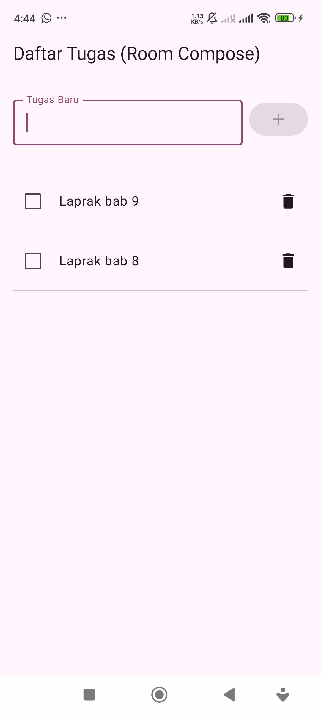
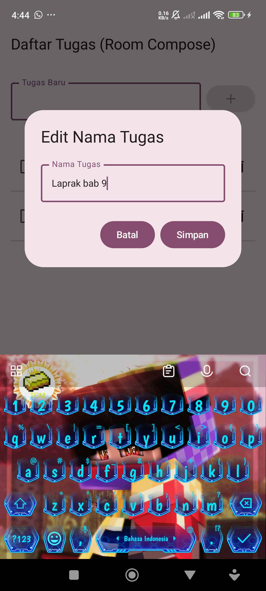

# Praktikum Room To-Do List

Aplikasi To-Do List sederhana untuk platform Android yang dibuat sebagai proyek praktikum. Aplikasi ini mendemonstrasikan implementasi penuh dari **Room Persistence Library** untuk mengelola database SQLite lokal.

Fokus utama proyek ini adalah menerapkan operasi **CRUD** (Create, Read, Update, Delete) lengkap dengan arsitektur modern Android (MVVM), Coroutines, dan Jetpack Compose.

## Fitur

Aplikasi ini memiliki fungsionalitas penuh untuk mengelola tugas:

* **Create:** Menambahkan tugas baru ke dalam daftar.
* **Read:** Menampilkan semua daftar tugas secara *real-time* (daftar akan otomatis update jika ada perubahan).
* **Update (Status):** Mengubah status tugas (selesai/belum) dengan mencentang *checkbox*.
* **Update (Nama Tugas):** Mengubah nama/judul tugas dengan mengklik teks tugas, yang akan memunculkan dialog edit.
* **Delete:** Menghapus tugas dari daftar.

## Teknologi dan Arsitektur

Proyek ini dibangun menggunakan tumpukan teknologi modern Android dan mengikuti arsitektur yang direkomendasikan.

* **UI:** **Jetpack Compose** (UI Toolkit deklaratif modern).
* **Database:** **Room** (Lapisan abstraksi di atas SQLite untuk persistensi data lokal).
* **Concurrency:** **Kotlin Coroutines** & **Flow** (Untuk operasi database asinkron dan *data stream* yang *observable*).
* **Arsitektur:** **MVVM (Model-View-ViewModel)**
    * **View (UI Layer):** `MainActivity.kt` (Berisi semua Composable function).
    * **ViewModel:** `TaskViewModel.kt` (Menyediakan data untuk UI dan menangani logika bisnis).
    * **Repository:** `TaskRepository.kt` (Sebagai *single source of truth* yang mengelola data dari DAO).
    * **Model (Data Layer):**
        * `Task.kt` (Entity yang merepresentasikan tabel database).
        * `TaskDao.kt` (DAO yang berisi kueri SQL untuk berinteraksi dengan tabel).
        * `TaskDatabase.kt` (Inisialisasi database Room).

## Tampilan Aplikasi

| Tampilan Utama | Dialog Edit Tugas |
| :---: | :---: |
|  |  |

## Cara Menjalankan

1.  Clone repository ini:
    ```bash
    git clone [https://github.com/nadhif-royal/PraktikumRoomToDoList.git](https://github.com/nadhif-royal/PraktikumRoomToDoList.git)
    ```
2.  Buka proyek menggunakan **Android Studio** (disarankan versi stabil terbaru).
3.  Biarkan Gradle melakukan sinkronisasi semua dependensi yang diperlukan.
4.  Jalankan aplikasi pada emulator atau perangkat Android fisik.
